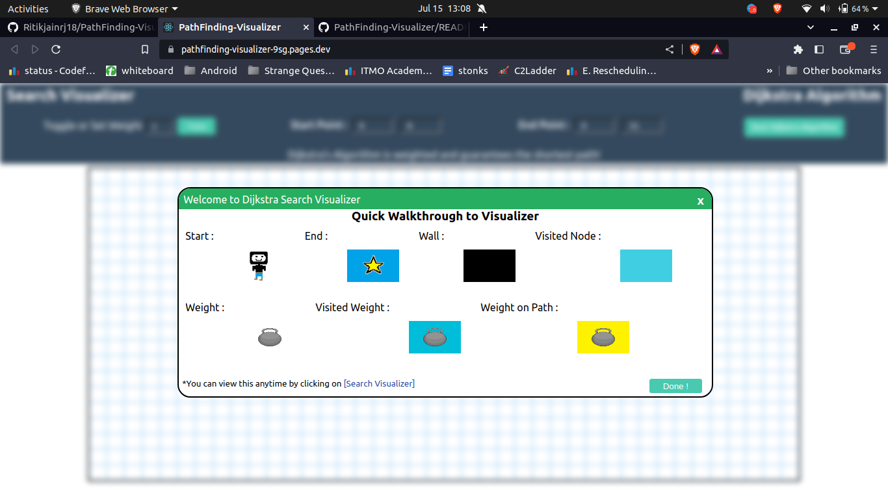
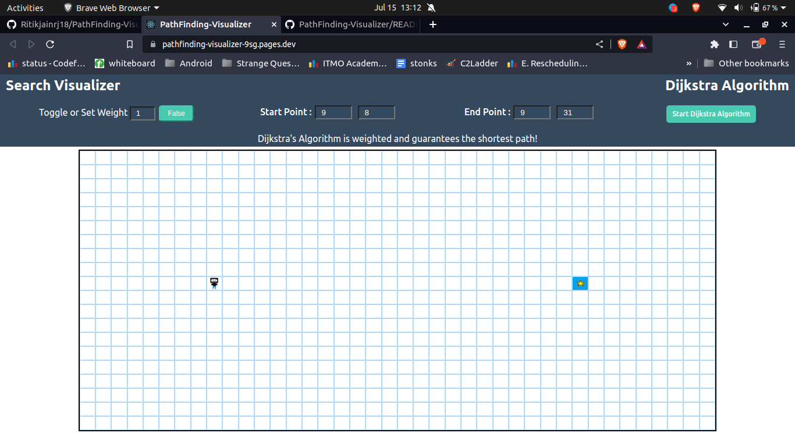
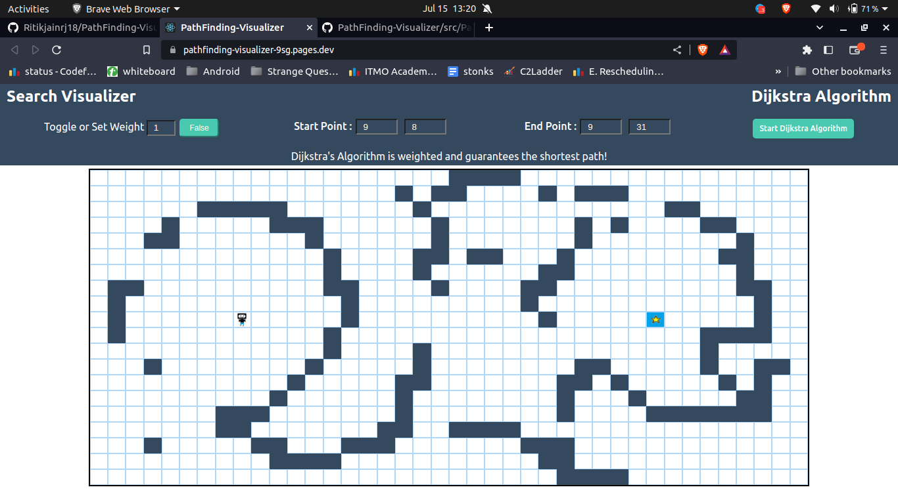
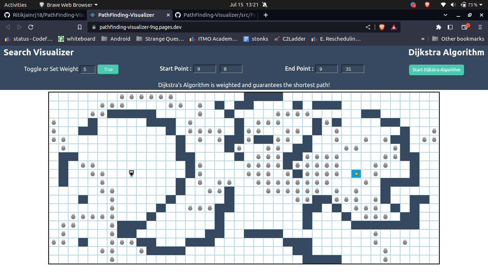
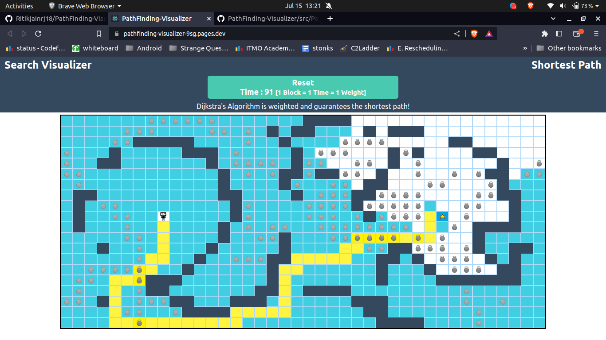

# PathFinding-Visualizer

This path-finding visualizer uses the Dijkstra's algorithm to find the shortest path between a source and destination node. Users can customize the paths by choosing the start and end nodes, and they can also add blocks or weights to nodes, influencing the optimal route.

# Dijkstra's algorithm

<!-- - Picks the unvisited vertex with the lowest distance.
- calculates the distance through it to each unvisited neighbor,
  and updates the neighbor's distance if smaller and repeat this until we visited all nodes. -->

Dijkstra's Algorithm analyzes the graph to find the shortest path between that node and all the other nodes in the graph.

- The algorithm keeps track of the currently known shortest distance from each node to the source node and it updates these values if it finds a shorter path.
- Once the algorithm has found the shortest path between the source node and another node, that node is marked as "visited" and added to the path.
- The process continues until all the nodes in the graph have been added to the path. This way, we have a path that connects the source node to all other nodes following the shortest path possible to reach each node.

The reason Dijkstra's algorithm works and guarantees the shortest path is due to its greedy nature. It always explores the node with the minimum distance first and updates the distance to its neighbors if a shorter path is found. Since the algorithm explores nodes in order of increasing distance, it ensures that the shortest distance to each node is found before exploring longer paths.

## Tech Stack Used

### ReactJs

1. Virtual DOM: Virtual DOM: ReactJS utilizes a virtual DOM (Document Object Model) to efficiently update and render user interfaces. By maintaining a lightweight representation of the actual DOM in memory, React can perform efficient updates and minimize unnecessary re-renders. This results in improved performance and a smoother user experience.
2. Rich Ecosystem and Community Support: ReactJS has a vibrant and active community with extensive resources, libraries, and tools available. This ecosystem provides a wide range of solutions for common development challenges.

### Cloudflare

Hosted front end on Cloudflare. It offers certain advantages.

1. Content Delivery Network (CDN):A CDN is a geographically distributed group of servers that caches content close to end users this improves visitors experience faster page loading times.
2. Easy Deployment and Continuous Integration: Cloudflare Pages offers seamless integration with popular version control systems such as GitHub. This allows for easy deployment of frontend updates through automated pipelines, ensuring a smooth and efficient development workflow.
3. Cost-effective Solution: Cloudflare Pages offers a generous free tier for hosting static websites and provides cost-effective pricing plans for higher traffic volumes.

## Screenshots

